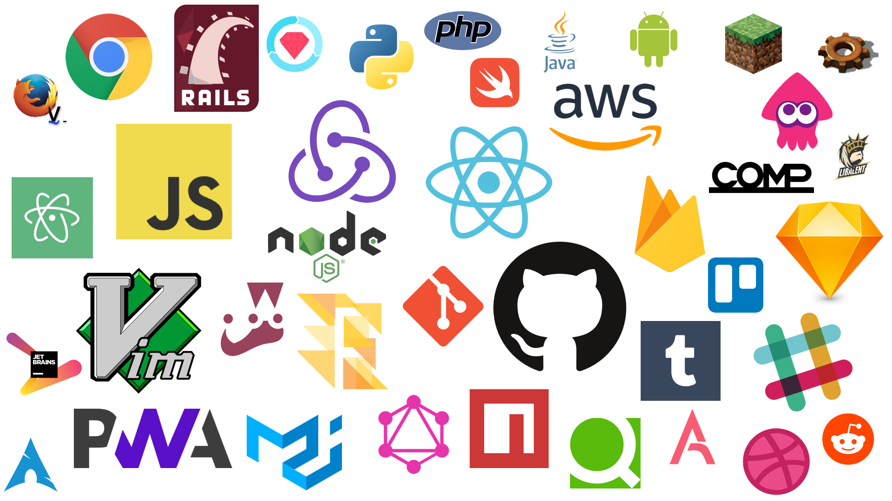
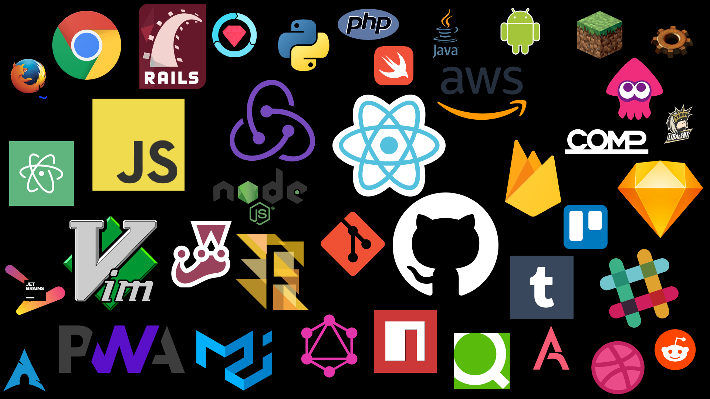
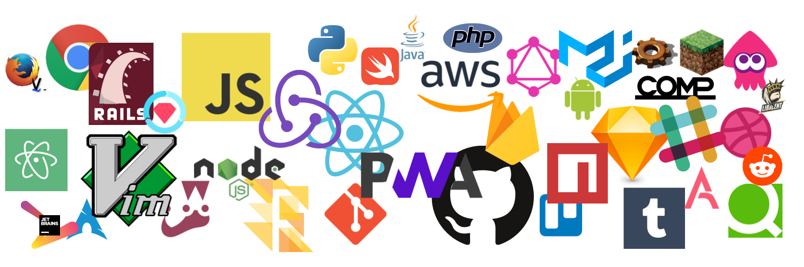

# DesktopStickers
> Desktop background with stickers of logo what I love.

## v4 (2018/08)
### white

### black

### header

## 🕰 History
[Releases](https://github.com/elzup/DesktopStickers/releases)

## Items

**IDE, editors**

* Atom
* vim
* Jetbrains

**unix**

* git
* ArchLinux

**Service tools**

* Github
* firebase
* npm
* Tumblr
* reddit
* Qiita
* dribble
* Annict
* COMP

**Application**

* Sketch
* Slack
* Google Chrome
* Trello
* Firefox
* android
* Vimperator

**language, framework**

* JavaScript
* node.js
* React
* Redux
* Flow
* PWA
* Python
* Ruby on Rails
* RSpec
* Swift
* PHP
* java
* Firebase
* AWS
* Jest
* GraphQL

**Game**

* Minecraft
* Factorio
* Splatoon2
* Fun Team: Libarent
