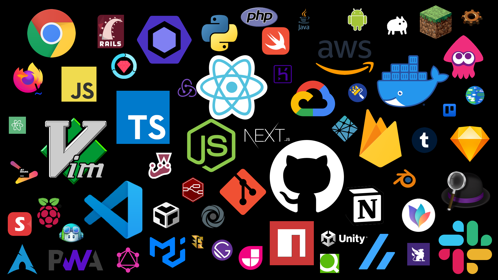

# DesktopStickers

> Desktop background with stickers of logo what I love.

## v6 (2021/11)

### white

### black

### header

## 🕰 History

[Releases](https://github.com/elzup/DesktopStickers/releases)

## Items

**IDE, editors**

- vim
- VSCode
- Jetbrains
- Atom

**unix**

- git
- ArchLinux
- Raspberry Pi
- Android

**Service tools**

- GitHub
- Firebase
- npm
- Tumblr
- reddit
- Qiita
- dribble
- Annict
- GitHub copilot
- Switchbot
- Zenn
- Jamstack
- Repl.it
- Next.js
- Netlify
- CodeSandbox
- Heroku

**Application**

- Sketch
- Slack
- Google Chrome
- Trello
- Firefox
- Vimperator
- MindNode
- Blender
- Alfred
- Habitica
- Renovate
- Node RED
- Notion

**language, framework**

- JavaScript
- node.js
- React
- Redux
- Flow
- PWA
- Python
- Ruby on Rails
- RSpec
- Swift
- PHP
- java
- Firebase
- AWS
- GCP
- Docker
- Jest
- GraphQL
- Material UI
- TypeScript
- Gatsby.js
- ESLint
- unity
- GraphQL

**Game**

- Minecraft
- Factorio
- Splatoon2
- Libarent
- Kurzgesagt
- Baba is you
- VRChat
