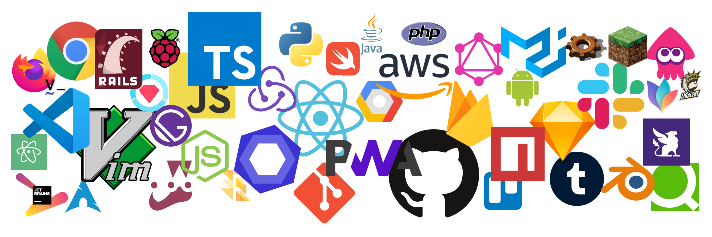

# DesktopStickers
> Desktop background with stickers of logo what I love.

## v4 (2018/08)
### white

### black

### header

## 🕰 History
[Releases](https://github.com/elzup/DesktopStickers/releases)

## Items

**IDE, editors**

* vim
* VSCode
* Jetbrains
* Atom

**unix**

* git
* ArchLinux
* Raspberry Pi
* Android

**Service tools**

* GitHub
* Firebase
* npm
* Tumblr
* reddit
* Qiita
* dribble
* Annict

**Application**

* Sketch
* Slack
* Google Chrome
* Trello
* Firefox
* Vimperator
* MindNode
* Blender
* Alfred
* Habitica

**language, framework**

* JavaScript
* node.js
* React
* Redux
* Flow
* PWA
* Python
* Ruby on Rails
* RSpec
* Swift
* PHP
* java
* Firebase
* AWS
* GCP
* Docker
* Jest
* GraphQL
* Material UI
* TypeScript
* Gatsby.js
* ESLint

**Game**

* Minecraft
* Factorio
* Splatoon2
* Fun Team: Libarent
